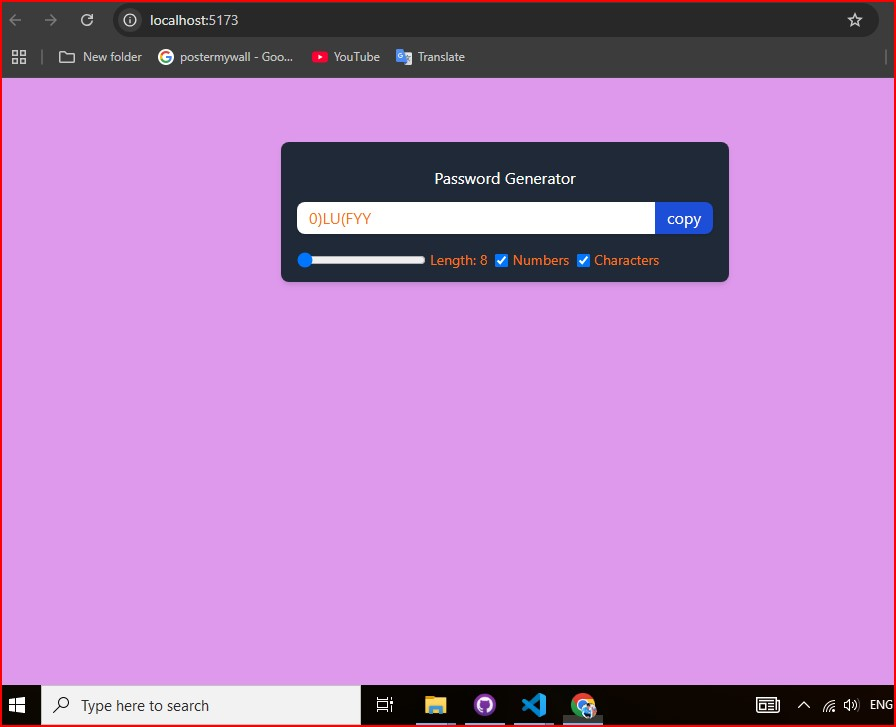

# Random-Password-Generator

It is an random-password-generator to generat password. Created using react js on frontend.

## Technologies used

1.  Html
2.  CSS
3.  JavaScript
4.  React Js
5.  Tailwind css
6.  Editors : VS code

## Screenshots

<div style="display: flex;flex-direction: column; grid-gap: 10px;">
    <div style="display: flex; grid-gap: 10px;">
        
        
    </div>    
      <div style="display: flex; grid-gap: 10px;">
        
    </div>
</div>
<br>

## How to use ?

As mentioned the project has two parts and both run on different server

### Run frontend code

Make sure you have node js installed on your machine

<b>Step-1 :</b> Locate the folder 'random-password-generator' using your terminal or command prompt.<br>

install neccessery libraries

```sh
cd random-password-generator
```

```sh
npm i
```

```sh
npm i react-router-dom
```

After the completion of these two you are ready to run the application : to run this type :

```sh
npm run dev
```

Visit the url appear on your terminal : In my case this is <i>[http://localhost:5173/] ctrl+ Click karo open to Browser</i>

   <br>
   
## Contributing

Pull requests are welcome. For major changes, please open an issue first
to discuss what you would like to change.

Please make sure to update tests as appropriate.
